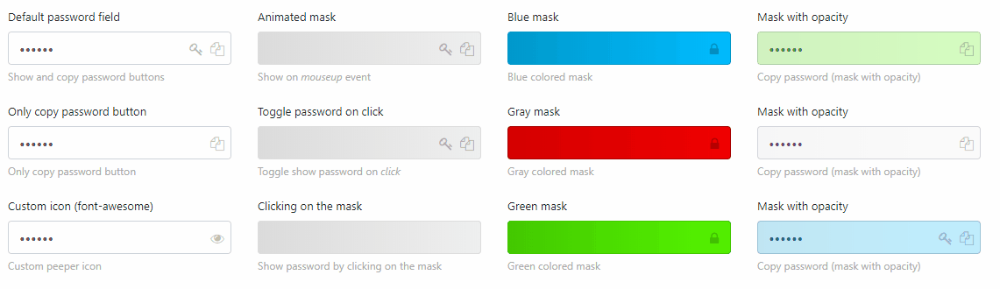

### jQuery-peeper
jQuery plugin designed to view and copy password as plain text from password type fields.



#### Installation

##### npm
```npm install jquery-peeper```

##### download

Download [latest release](https://github.com/msztorc/jquery-peeper/releases/latest) 

CSS

```
<link rel="stylesheet" href="/jquery-peeper/dist/css/jquery-peeper.min.css" />
```

JS

```
<script src="/jquery-peeper/dist/js/jquery-peeper.min.js"></script>
```

#### Usage

```js
$(function() {
    $("#password1").peeper();
});
```

More options
```js
$(function() {
    $("#password1").peeper({
    showEvent: 'mouseup', // event to show password 
    showElement: '.peeper-mask', // DOM element (eg. button to show password)
    mask: true, // show mask
    maskOpacity: 1, //mask opacity (eg. 0.5)
    autohide: true, // hide password after time
    autohideTime: 4000, // hide password time in ms
    maskCss: 'gray', // mask style (eg. red, green, blue or custom)
    showPasswordCss: 'fa fa-key', // show password icon/style
    copyPasswordCss: 'fa fa-copy', // copy password icon/style
    showCopyBtn: true, // copy password button
    showPasswordBtn: true, // show password button
    animateDuration: 300 // mask animation time
    });
});
```

#### TODO
- passwords generator
- more animations
- more styles

### License
MIT
